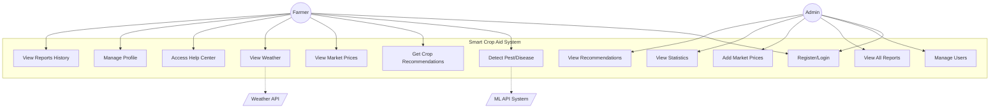
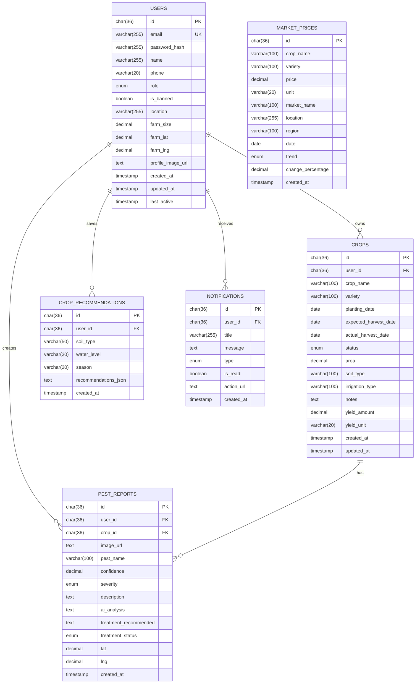
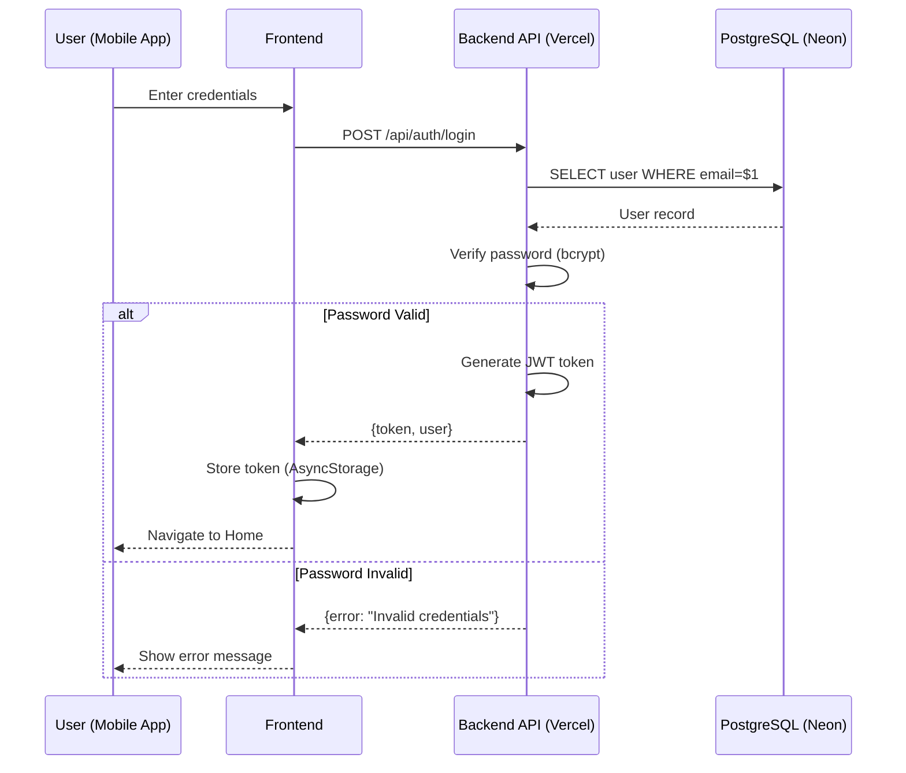
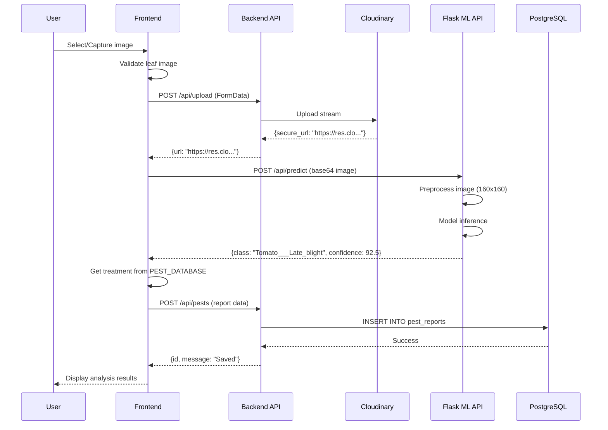
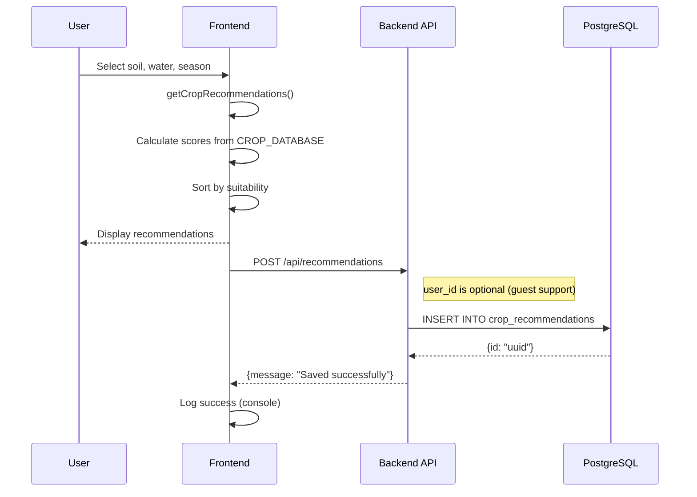
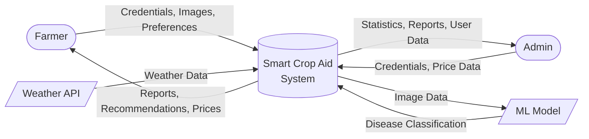
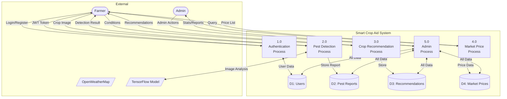
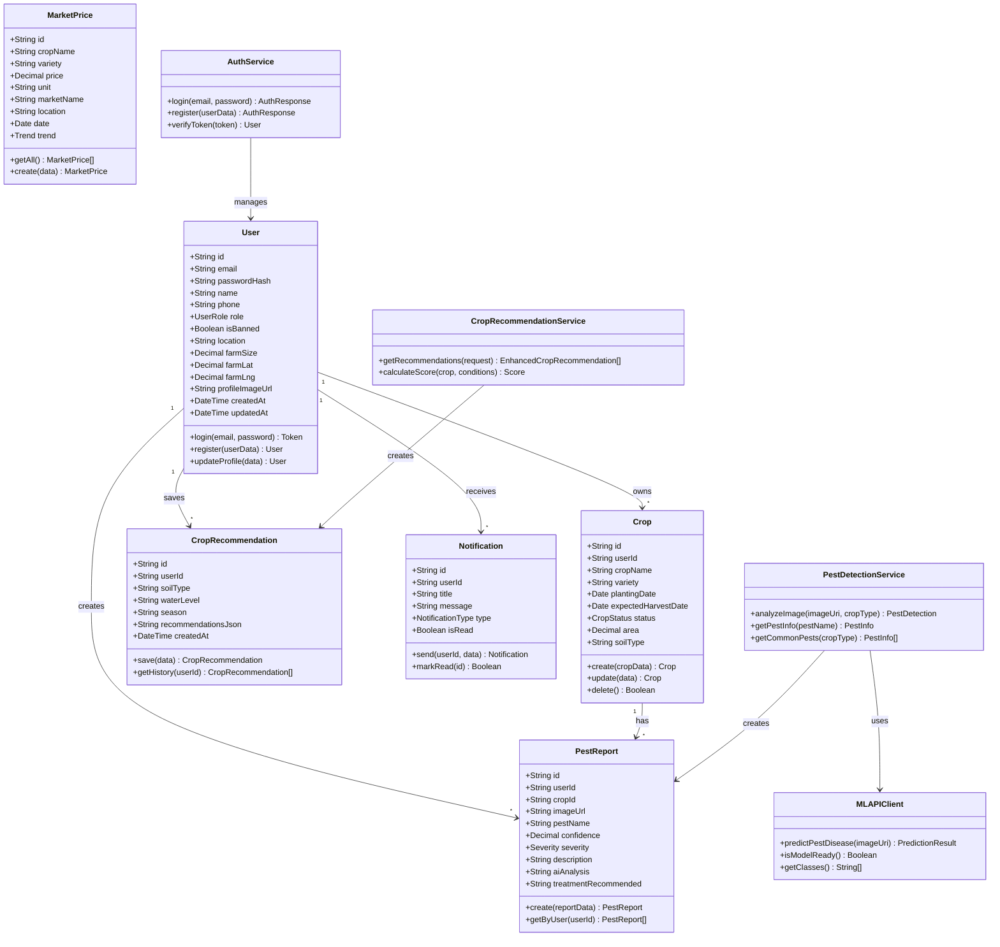
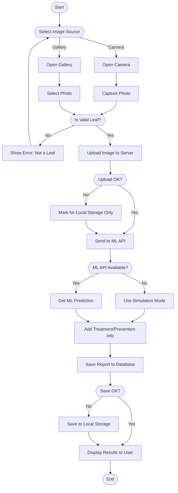
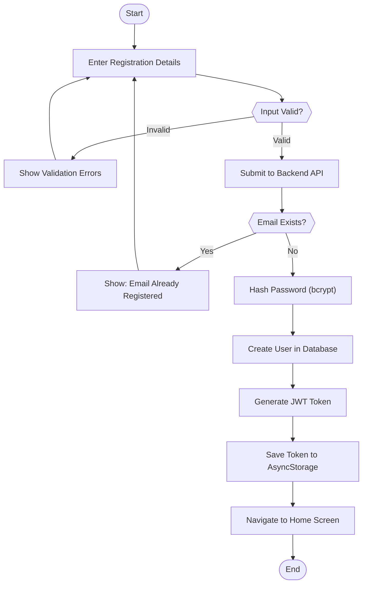

# Smart Crop Aid - Software Engineering Diagrams

> UML and System Diagrams for Smart Crop Aid Application

---

## Table of Contents
1. [Use Case Diagram](#1-use-case-diagram)
2. [Entity-Relationship (ER) Diagram](#2-entity-relationship-er-diagram)
3. [Sequence Diagrams](#3-sequence-diagrams)
4. [Data Flow Diagrams](#4-data-flow-diagrams)
5. [Class Diagram](#5-class-diagram)
6. [Activity Diagrams](#6-activity-diagrams)
7. [Object Diagram](#7-object-diagram)

---

## 1. Use Case Diagram

### Use Case Descriptions

| ID | Use Case | Actor | Description |
|----|----------|-------|-------------|
| UC1 | Register/Login | Farmer, Admin | User authentication and account creation |
| UC2 | Detect Pest/Disease | Farmer | Upload crop image for AI analysis |
| UC3 | Get Crop Recommendations | Farmer | Get personalized crop suggestions |
| UC4 | View Market Prices | Farmer | Browse commodity prices |
| UC5 | View Weather | Farmer | Get location-based weather data |
| UC6 | Access Help Center | Farmer | View FAQs and farming tips |
| UC7 | Manage Profile | Farmer | Update account settings |
| UC8 | View Reports History | Farmer | View past pest detection reports |
| UC9 | Manage Users | Admin | Ban/unban user accounts |
| UC10 | View All Reports | Admin | View all pest reports system-wide |
| UC11 | Add Market Prices | Admin | Add/update commodity prices |
| UC12 | View Statistics | Admin | View system usage statistics |
| UC13 | View Recommendations | Admin | View all saved recommendations |

---

## 2. Entity-Relationship (ER) Diagram

---

## 3. Sequence Diagrams

### 3.1 User Authentication Sequence

### 3.2 Pest Detection Sequence

### 3.3 Crop Recommendation Sequence

---

## 4. Data Flow Diagrams

### 4.1 DFD Level 0 (Context Diagram)

### 4.2 DFD Level 1

---

## 5. Class Diagram

---

## 6. Activity Diagrams

### 6.1 Pest Detection Activity

### 6.2 User Registration Activity

---

## 7. Diagram Legend

| Symbol | Meaning |
|--------|---------|
| `([...])` | Start/End (Terminal) |
| `[...]` | Process/Action |
| `{...}` | Decision |
| `((...))` | External Entity |
| `[/".../"/]` | External System |
| `[("...")]` | Data Store |
| `-->` | Data Flow / Control Flow |
| `<-->` | Bidirectional Flow |
| `-.->` | Dependency |

---

Created for Smart Crop Aid v1.0.0 | December 2024

